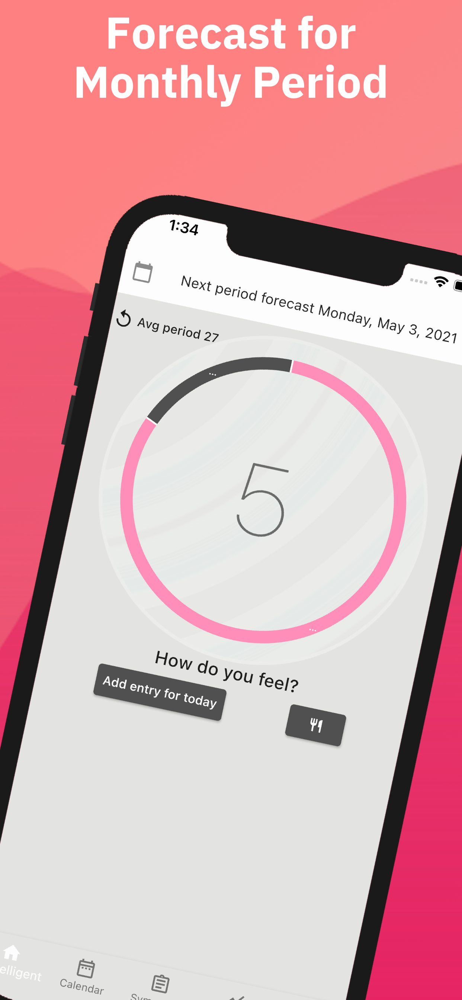
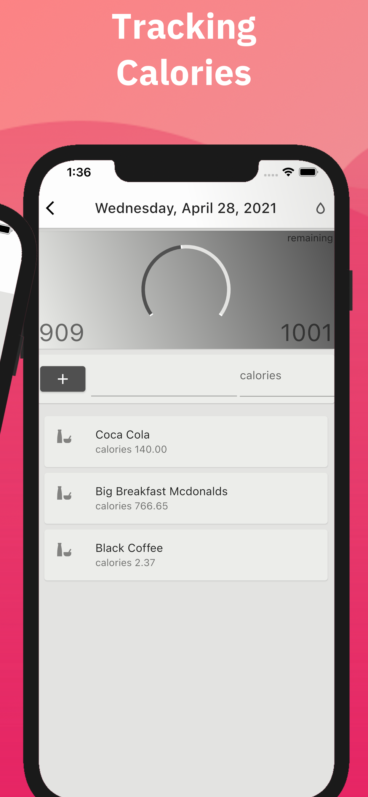
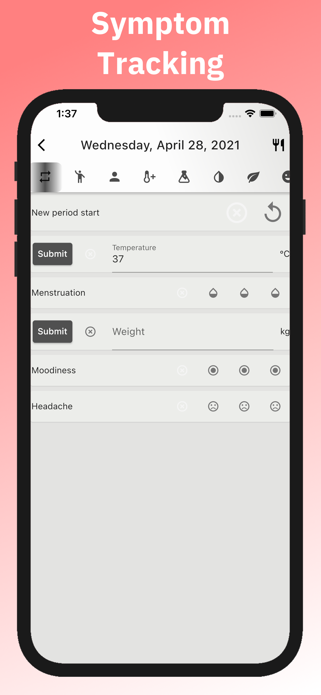

# Appstore Playstore image preparation
We would like to automate screenshot image creation for the appstore publishing. It take a lot of time to keep the app screenshots up to date. Even more time, if the app includes localization.
## Script start
```shell
python3 image_preparation.py
```

# Settings
Before you start, please download or change the location for your favorite font, for example google fonts.
```python
font_path = 'font/IBMPlexSans-Bold.ttf'
```

Python Pillow package is required
```shell
pip3 install Pillow
```
## Included backgrounds
### Simple background

### Double background
Background for two pictures.


# Example
In the default we included screenshots from our App femtelligent:
-<https://play.google.com/store/apps/details?id=info.foreverycast.perionatural>
## Final result
<p float="left">
  
  
  
</p>
# TODO 
-add background generator

# Used images
used images from
-<https://de.wikipedia.org/wiki/Datei:Pixel_3_schematic.svg>
-<https://creativecommons.org/licenses/by-sa/4.0/deed.de>
